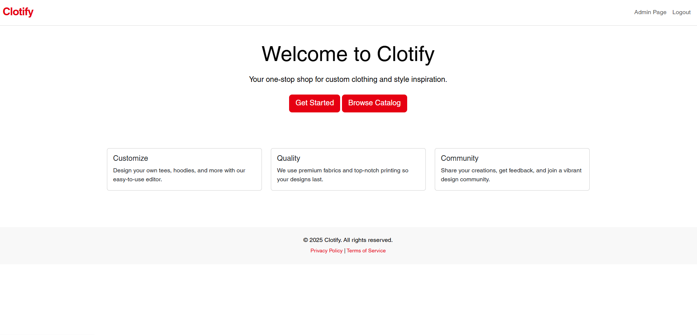
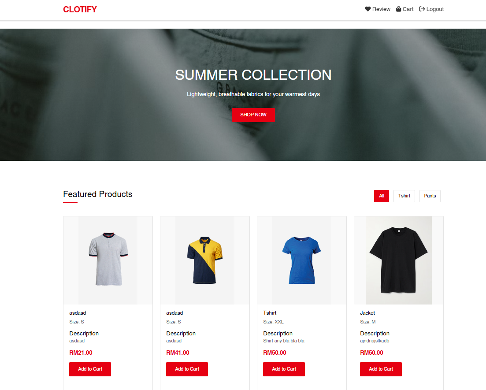
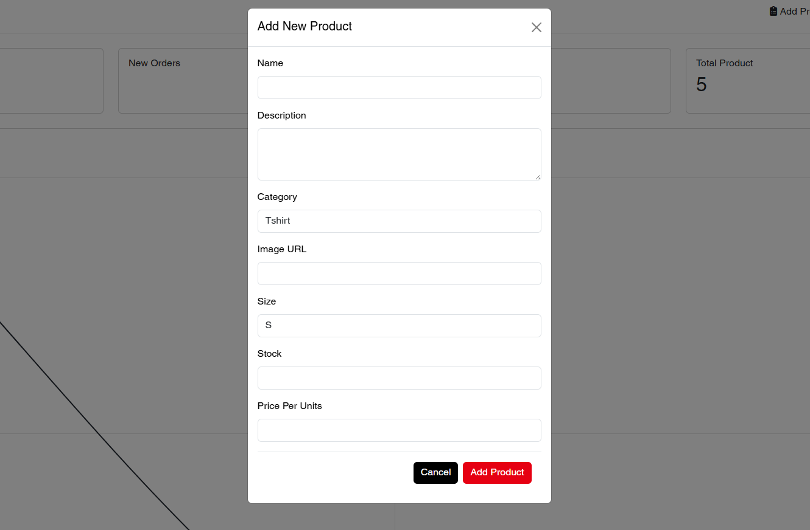
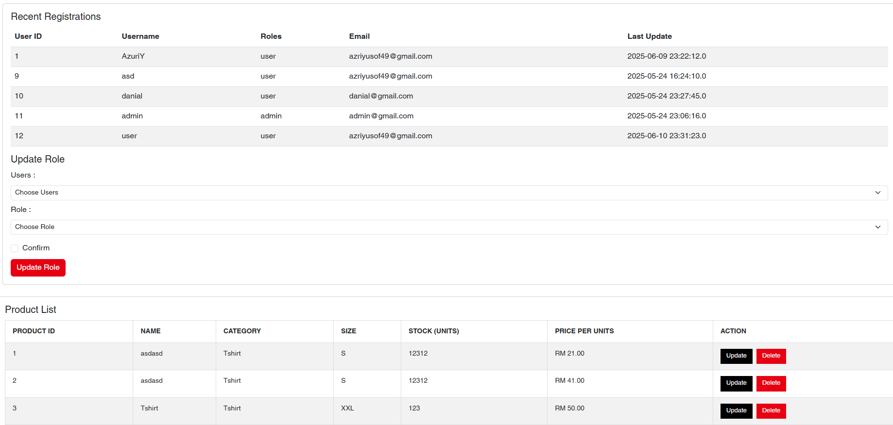

# 🎓 Clotify E-Commerce (JSP & Servlets)

A simple web-based E-Commerce built using **Java EE (JSP & Servlets)**, styled with **Bootstrap**, and powered by a **MySQL** backend.

This project supports role-based access (Admin & User), product management, cart management, review management.

---

## 🛠️ Technologies Used

| Technology     | Description                      |
|----------------|----------------------------------|
| Java           | Backend programming language     |
| JSP / Servlets | Web rendering and controllers    |
| MySQL          | Relational database              |
| Bootstrap      | Front-end styling                |
| NetBeans       | IDE for development              |

---

## 🚀 Features

### 👨‍💼 Admin

- Secure login
- Create, update, and delete product
- View user and update role user
- View real-time user growth chart

### 👨‍🎓 User

- Role-based session and navigation
- View list product

### 📊 Charts

- Line Chart: User per Time

### 📄 Calculation
- Calculate total product add on cart

---

## 📸 Screenshots

### Home Page

### Catalog

### Admin

---

## 👨‍💻 Author

Azri Yusof [S69911]
[LinkedIn](https://www.linkedin.com/in/azriyusof49?lipi=urn%3Ali%3Apage%3Ad_flagship3_profile_view_base_contact_details%3BnwNuuhRhQhmJa4S%2BKZb1ig%3D%3D)
Danial [S72342]
Muflih [S72570]
