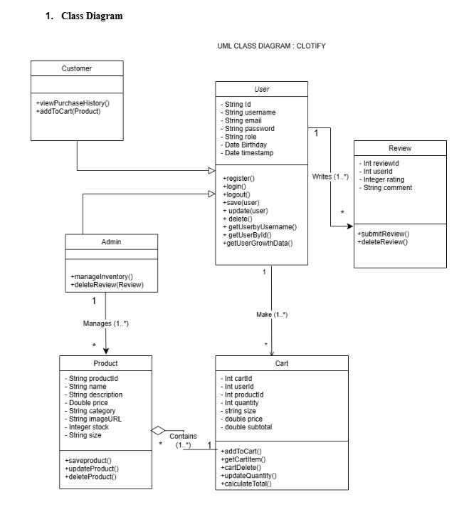

# 🎓 Clotify E-Commerce

A clean and functional **Java EE** E-Commerce platform built with **JSP & Servlets**, styled using **Bootstrap**, and backed by **MySQL**. This web app features **role-based access**, **product management**, **shopping cart**, **user reviews**, and **real-time analytics**.

---

## 🛠️ Tech Stack

| Technology | Role                              |
| ---------- | --------------------------------- |
| Java EE    | Backend logic with JSP & Servlets |
| MySQL      | Relational database               |
| Bootstrap  | Responsive front-end styling      |
| NetBeans   | Development IDE                   |

---

## 🚀 Getting Started

### 1. Clone the Repository

```bash
git clone https://github.com/azriyusof49/clotify.git
cd clotify
```

### 2. Open in NetBeans

* Launch NetBeans
* Go to **File → Open Project**
* Select the `clotify` folder

### 3. Set Up MySQL

* Open **phpMyAdmin** or your preferred MySQL client
* Create a new database called `clotify`
* Import the `clotify.sql` file included in the project root to create tables and insert sample data

---

## ✅ Features

### 👨‍💼 Admin Panel

* Admin login authentication
* View and manage user roles
* View user registration trends in a chart

### 🛜️ Product Management (Admin Only)

* Secure admin login to access product dashboard
* Create products with title, description, price, specifications, and images
* Update products (price, stock, category, status: active/featured/discontinued)
* Delete products from catalog (admin-only access)
* View full product list with real-time filter
* Maintain audit log of all product changes (for accountability)

### 🛒 Cart Management

* Add to Cart: Select product with quantity, color, and size
* Real-time stock and price validation before adding items
* View Cart: Show product details, quantity, and subtotal in MYR
* Update Cart: Adjust quantity or remove items
* Clear Cart: Remove individual or all items with confirmation prompt
* Checkout: Pre-checkout stock validation + redirect to order page

### 💬 Review Management

* Only logged-in users can submit reviews
* Create Review: General feedback (rating + comment)
* View Reviews: All submitted reviews with name/alias + rating
* Delete Review: Admin can delete cutomer reviews

### 👤 User Functionality

* Secure login and registration
* Browse and search products
* Add products to cart and view cart total
* Submit and view reviews

### 📊 Analytics

* 📈 Line Chart: Track user registration over time

---

## 🖼️ Screenshots
### 🔹 Class Diagram


### 🔹 Home Page


### 🔹 Product Catalog


### 🔹 Admin Panel


---

## 🗄️ Folder Structure

```
clotify/
├── Web/
│   ├── META-INF/
│   │   └── context.xml
│   ├── WEB-INF/
│   │   └── web.xml
│   ├── admin_homepage.jsp
│   ├── cart.jsp
│   ├── catalog.jsp
│   ├── homepage.jsp
│   ├── index.html
│   ├── navbaradmin.jsp
│   ├── register.html
│   ├── review.jsp
│   ├── script.js
│   └── style.css
├── src/
│   ├── default package/
│   │   └── login.java, Register.java
│   ├── cartModule package/
│   │   └── addCart.java, cart.java, cartData.java, cartDelete.java, updateQuantity.java
│   ├── productModule package/
│   │   └── addProduct.java, deleteProduct.java, product.java, productData.java,
│   │       productData.java, updateProduct.java
│   ├── reviewModule package/
│   │   └── addReview.java, deleteReview.java, review.java, reviewData.java
│   └── UserModule package/
│       └── user.java, userData.java, updateRole.java
├── README.md
```

---

## 👨‍💼 Authors

* **Azri Yusof** \[S69911] — [LinkedIn](https://www.linkedin.com/in/azriyusof49)
* **Danial** \[S72342]
* **Muflih** \[S72570]

---

## 📃 License

This project is licensed under the MIT License. See `LICENSE` for more details.
